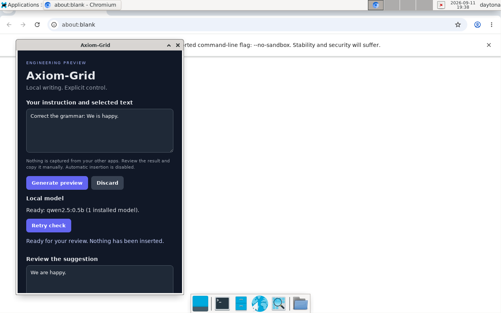
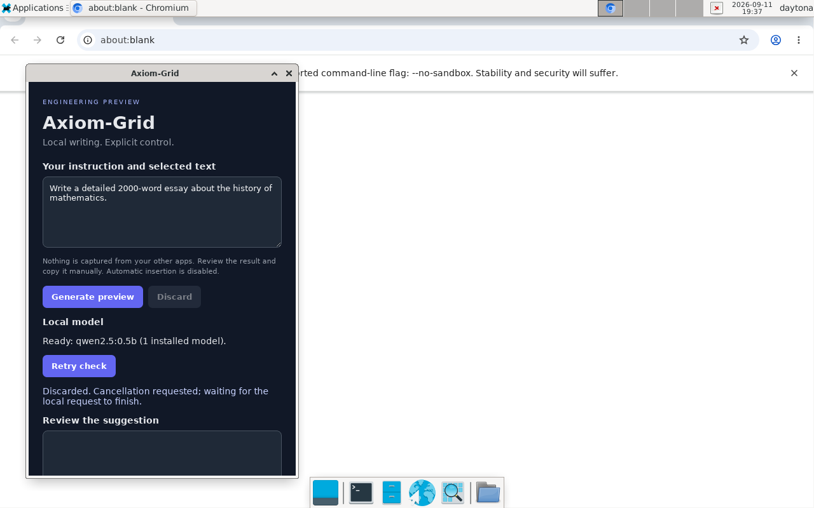
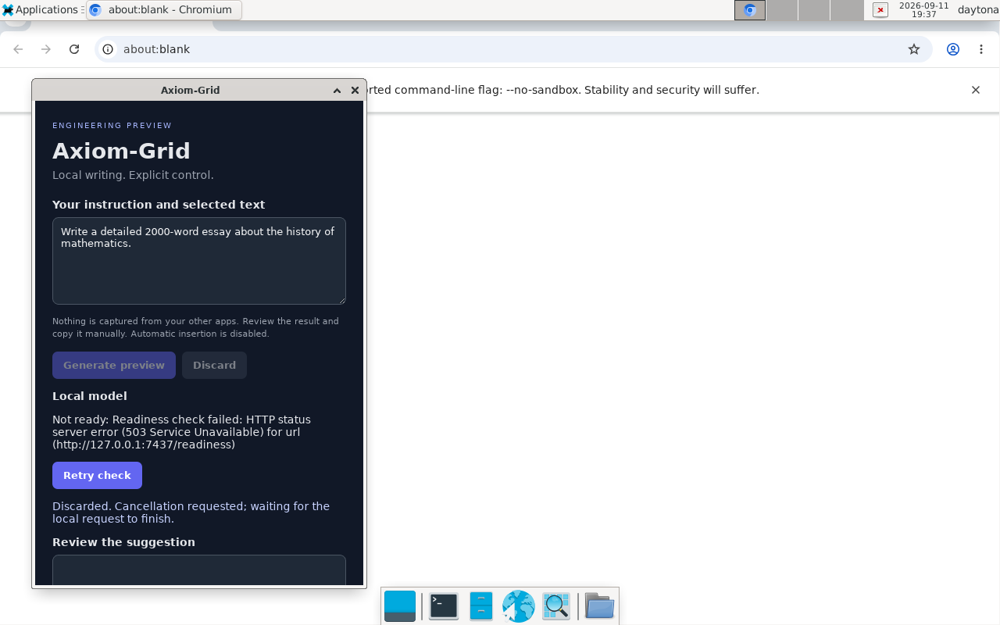

# Session 012 — real inference, native desktop validation, and regression fixes

## Decision: engineering preview improved; production remains NO-GO

Fresh clone began clean on `main` at `25f0caf75f74e6eb19b0fcd7e70af0a73652d703`.
Reviewed the attached SESSION-010 in full, SESSION-011, HANDOFF-001–004 and LAUNCH-GATES.
GitHub API showed focused CI successful at the starting HEAD. Previous “no backlog”
claims were incorrect: HANDOFF-002 and LAUNCH-GATES contain substantial open work.

## Implemented and regression-tested

- Readiness now fails closed before startup checks finish, in browser-only mode,
  on malformed results and after errors. Newer checks supersede stale responses.
  Retry and generation completion cannot incorrectly enable concurrent generation.
- Discard no longer swallows cancellation errors or claims the model stopped merely
  because a command was sent. New generation stays blocked while cancellation
  acknowledgement is outstanding; late results remain discarded.
- Runtime rejects non-success HTTP statuses even if the body contains valid model
  JSON (reqwest `error_for_status` alone accepts redirects). Both generation and
  readiness now enforce this boundary.
- Model inventory bodies are capped at 256 KiB, including chunked responses, matching
  the existing generation safety boundary.
- Added an opt-in stdlib-only real Ollama E2E runner, `scripts/axiom-live-e2e.py`.
  It never downloads a model or substitutes model responses. Run against an already
  started runtime: `python3 scripts/axiom-live-e2e.py --output evidence.json`.

Six new UI regressions and two runtime regressions were run against the old code
and failed before the fixes. Two additional UI tests cover malformed readiness and
cancellation acknowledgement/new-generation ordering. Shipped implementations use
real IPC/inference; deterministic test doubles remain in unit tests only.

## Gates executed locally

| Gate | Result |
|---|---|
| Runtime fmt --check | PASS |
| Runtime cargo test --locked | PASS: 25 (12 API, 3 cancel, 1 pairing, 9 retained regressions) |
| Runtime Clippy --locked --all-targets -- -D warnings | PASS |
| Runtime release build --locked | PASS |
| Overlay fmt --check | PASS |
| Overlay Clippy --all-targets -- -D warnings | PASS |
| Overlay native build, including final embedded assets | PASS |
| Node unit tests | PASS: 17/17 |
| Node syntax check | PASS |
| New Python runner Ruff lint/format | PASS |
| Real installed-model release-binary checks | PASS: 32 assertions, including 20 prompts, auth, Unicode counts, cancel 499 and recovery |

Rust 1.98.1 installed locally. Unlike earlier sandboxes, this one has passwordless
sudo and a GUI: installed WebKitGTK/GTK/appindicator prerequisites and actually
compiled and ran Tauri. Native build used CARGO_PROFILE_DEV_DEBUG=0 and four jobs.
This is the focused Axiom surface, NOT the inherited monorepo's entire test suite.

## Real model evidence (not a loopback stand-in)

Official Ollama 0.34.0, CPU-only with cloud disabled. Explicitly downloaded
`qwen2.5:0.5b` (Q4_K_M, 494.03M parameters, Apache 2.0 license reported by model).
Digest: `a8b0c51577010a279d933d14c2a8ab4b268079d44c5c8830c0a93900f1827c67`.
Raw metadata/license, prompts/results, model-reported allocation and environment
are in `evidence/session-012-real-model.json`.

Final revised release binary: first request after model unload **7.791 s**;
19 subsequent requests **p50 2.198 s / p95 4.997 s**, nearest-rank percentile.
Concurrent Rust compilation and a shared Debian 13 sandbox make these observations,
not minimum-hardware or production performance commitments. Model-reported loaded
allocation was approximately 435 MiB, zero VRAM; this is not measured peak process RAM.
No first-token metric is claimed because this API is nonstreaming.

A real long generation was cancelled (499), then a new generation succeeded.
Missing configured model: HTTP 200 with ready=false. Stopped actual Ollama daemon:
HTTP 503. Daemon restart recovered to ready=true. Runtime restart retained pairing,
file mode 0600. No pairing token found in captured runtime/overlay/Ollama logs.
This is not a full privacy or zero-egress audit.

## Native Tauri manual smoke

- Automatic pairing and model readiness succeeded in the actual GTK/WebKit window.
- Entered explicit text, generated with real Ollama and saw the review-only result.
- Discarded an actual long generation; result remained blank and controls recovered.
- Stopped Ollama, used Retry check: actionable unavailable state, Generate disabled.
- Restarted both daemon and native app; readiness and another real generation worked.
- Unicode API counts passed. Desktop Unicode input/copy and all-platform UX are NOT
  certified: the synthetic keyboard path logged Unidentified(Gtk(204)) for Unicode.
- GTK emitted an appindicator deprecation warning and a Gdk thaw assertion on startup;
  app remained functional, but these native diagnostics need release investigation.

## Complete remaining backlog extracted from handoffs / launch gates

| Priority | Work | Current disposition |
|---|---|---|
| P0 | Focused runtime/overlay compile gates | Implemented; locally passed; platform matrix remains |
| P0 | Server cancellation and bridge propagation | Implemented; actual runtime/native smoke; adversarial bridge races still require coverage |
| P0 | Per-user pairing | Unix implementation exercised; Windows CSPRNG unsupported, symlink/concurrent-create hardening and rotation still open |
| P0 | Installed-model protocol | 20 real prompts recorded here; chosen launch OS/minimum HW, peak RAM, first-token and human usefulness ratings still open |
| P0 | Native UI | Linux smoke performed; Unicode manual copy, clipboard/focus/hotkey cases, platform matrix and clean-machine UX still open |
| P0 | Model onboarding | Inventory/readiness exists; selection, approved downloads/progress, license/disk checks remain |
| P0 | Safe insertion | Deliberately disabled; target/element/revision binding, approval hash/expiry, revalidation, replay protection, undo/clipboard restoration and two-editor native matrix required |
| P1 | Extraction | Isolate/simplify Tauri workspace; dependency analysis before deleting legacy modules; retire inherited claims |
| P1 | GhostSession API | Encapsulate public mutable state into guarded transitions |
| P1 | Resilience | Fuzz/property, load, body/chunk-timeout tests, bounded graceful draining; inventory bound improved here |
| P1 | Security/privacy | Local adversary/model compromise and prompt injection review, persistent logs, network observation, dependency audit/SBOM |
| Release | Distribution | Signed/notarized installers, checksums, upgrade/rollback/uninstall and clean-machine tests |
| Market | Validation | 5–10 users, observed repeat use, time saved, willingness-to-pay interviews |

The small model gave demonstrably weak punctuation/translation/rewriting answers.
Nonempty HTTP 200 output is NOT proof of quality. No human usefulness review was
fabricated. Signing identities, target platforms, product/model choice and partner
access must be supplied before these gates can close.

Changes should remain on a review branch, not merged as a production release.
The exposed GitHub credential must be rotated; it is not included in source, logs,
remote URLs or this record. No global “zero regressions” claim is justified.
