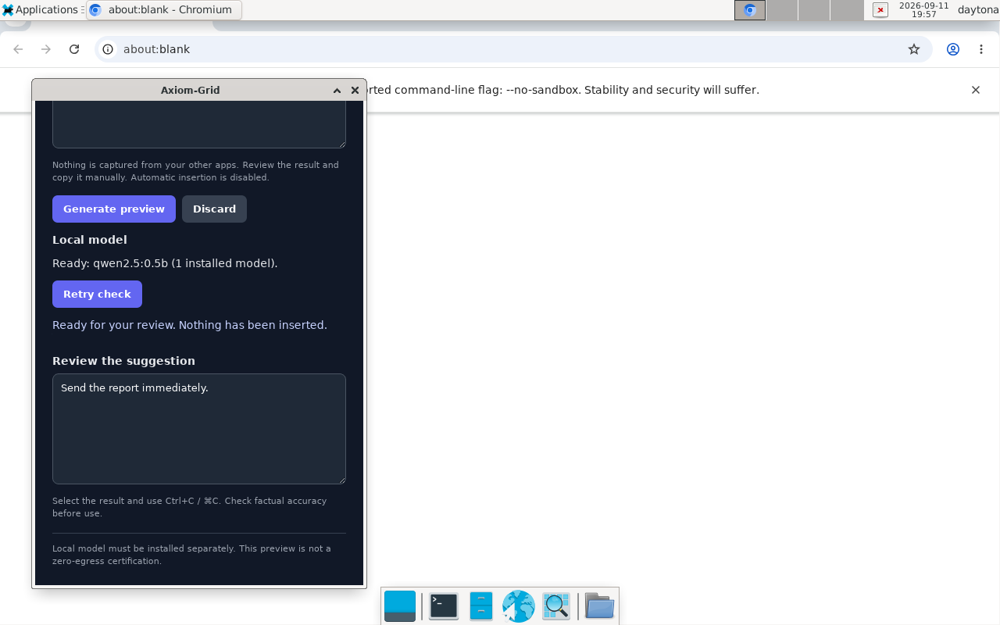

# Session 013 — pairing security and bounded shutdown

## Decision: production remains NO-GO

Fresh clone: main `465bbc7400dda31a4d901b0966cf87b7e0b8d8b7`, clean.
Review base: `0290a129a0150b6b178cbc29b6693b7ef01f1c70` on the previous
real-model-hardening branch. That branch contains actual regression fixes absent
from main. Continued on `fix/session-013-pairing-hardening`; did not overwrite
main or claim the entire remaining product backlog is complete.

Read both attachments fully and HANDOFF-001–004, SESSION-012-REAL-MODEL and
LAUNCH-GATES. The documentation-only “no code backlog” conclusion was wrong.
The complete extraction and acceptance criteria are in SESSION-013-BACKLOG.md.

## Implemented

- Descriptor-relative Unix pairing: reject symlinks at every component; enforce
  trusted ancestors and private owner/mode at the final directory. Never chmod a
  path on startup or truncate a linked file.
- Both runtime and overlay reject malformed/oversized credentials, hardlinks,
  special files, incorrect ownership and permissive modes. Nonblocking opens
  prevent FIFO-induced startup hangs.
- Two-second-bounded directory flock serializes independent processes. New token
  publication writes a private temporary file, fsyncs, atomically renames and
  fsyncs the directory. No partial token becomes visible to cooperating readers.
- Unsafe/corrupt existing credentials require explicit recovery, not silent reuse
  or replacement. Added operator runbook and threat-boundary documentation.
  Windows protected file storage remains unsupported, explicitly fail-closed.
- SIGINT/SIGTERM graceful shutdown has a five-second drain deadline, including
  stalled request bodies. Added actual process/socket/signal integration coverage.

The new symlink regression **failed on the original implementation**, which
followed and overwrote a target file. Evidence is committed. Runtime application
paths use actual OS facilities and local model inference, not stubs. Deterministic
unit API tests still use test doubles; they are not labeled real-model evidence.

## Validation on the final implementation

| Gate | Result |
|---|---|
| Focused runtime cargo test --locked | 28 passed (12 API, 3 cancel, 1 lifecycle, 2 security/helper, 9 retained regressions, 1 shutdown) |
| Pairing concurrency | 16 independent processes × 20 repeated load/create/read cycles; same credential, no partial publication |
| Pairing adversarial cases | Symlink target/ancestor, hardlink, FIFO, oversized file, unsafe ancestor, permissions, corruption, lock timeout and release pass |
| Shutdown process test | SIGTERM idle and stalled-body cases pass; stalled case exits within 8-second test allowance for five-second drain |
| Runtime Clippy --locked --all-targets -D warnings | Pass |
| Runtime locked release build | Pass |
| Runtime and overlay rustfmt | Pass |
| Overlay locked native Linux build | Pass |
| Overlay locked Clippy --all-targets -D warnings | Pass |
| Frontend Node tests / syntax | 17 passed / pass |
| Python live-runner Ruff lint/format | Pass |
| Real final release-binary E2E | 32 assertions, 20 prompts; actual Ollama 0.34.0 CPU model, cancellation 499 and recovery pass |
| Explicit credential rotation | Stop consumers, remove token, restart: credential changes, old token 401, new readiness 200/ready, file 0600 |
| Log token scan | Neither old nor new token present in captured runtime/overlay/Ollama logs |
| Native desktop | Actual window pairs, reports ready, generates review-only text; credential-refresh restart reports ready |
| Inherited workspace suite | Compilation attempted, then aborted for resource budget. NOT passed |

Real-model latency on this shared sandbox with concurrent compilation: first
request 1.236 seconds (**warm**, not unloaded/cold); remaining p50 1.402 seconds,
p95 2.502 seconds. This does not measure first-token latency, peak process RAM,
human usefulness or minimum hardware. Model digest/license/raw outputs are in
`evidence/session-013-real-model.json`; the tiny model is a validation fixture,
not an approved production model.

GTK still emits the appindicator deprecation warning and Gdk thaw assertion on
startup; these pre-existing diagnostics are not fixed or certified harmless.
Unicode manual-copy, focus/hotkey/platform matrices are still open. No signed
installer or universal regression certification is claimed.

## Remaining work

See SESSION-013-BACKLOG.md for every open package: Windows pairing, coordinated
credential lifecycle, model onboarding, native/target-hardware qualification,
usefulness, safe insertion, extraction/GhostSession encapsulation, resilience,
security/privacy/dependency audit/SBOM, distribution and partner validation.
Automatic insertion stays disabled. No production merge/release is justified.

## Credential discipline

Only Kartik24Hulmukh/Axiom-Grid is a write target. The exposed GitHub credential
must be rotated. It is not stored in source, remote URLs or handoff files.
